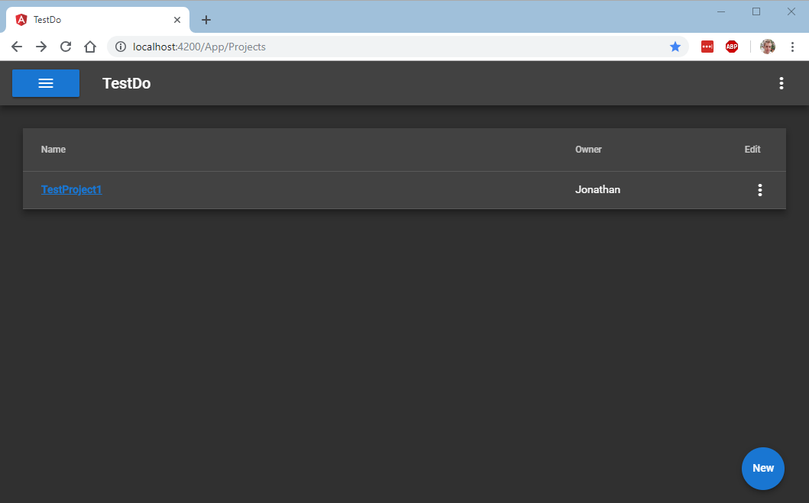

# TestDoServer

This repo combines ASP.NET and an Angular application using Identity Server 4 for authentication.

This repo replaces [https://github.com/JonathanSiddle/Test-do](https://github.com/JonathanSiddle/Test-do) the Anglar application inside '/test-do' this the latest version of this application and can be used with the standard Angular CLI.

The entire project is wrapped in a solution consisting of .NET Core application and can be opend with Visual Studio or standard .NET tool.

## Still to do: 

- [x] Create TestDo Angular Application 
- [x] Create ASP.NET Core backend 
- [x] Integrate Identity Server 4
- [ ] Use single MariaDB to store data
- [ ] Finish Auth integration 
- [ ] Protect API
- [ ] Pass Auth token to Angular app
- [ ] Allow Angular App to refresh token
- [ ] A better state management solution 
- [ ] More unit tests  

## Screenshots 

### Projects

### Project Lists

### ToDo List

## License

This project is licensed under MIT: 

MIT License

Copyright (c) 2018 Jonathan Siddle

Permission is hereby granted, free of charge, to any person obtaining a copy
of this software and associated documentation files (the "Software"), to deal
in the Software without restriction, including without limitation the rights
to use, copy, modify, merge, publish, distribute, sublicense, and/or sell
copies of the Software, and to permit persons to whom the Software is
furnished to do so, subject to the following conditions:

The above copyright notice and this permission notice shall be included in all
copies or substantial portions of the Software.

THE SOFTWARE IS PROVIDED "AS IS", WITHOUT WARRANTY OF ANY KIND, EXPRESS OR
IMPLIED, INCLUDING BUT NOT LIMITED TO THE WARRANTIES OF MERCHANTABILITY,
FITNESS FOR A PARTICULAR PURPOSE AND NONINFRINGEMENT. IN NO EVENT SHALL TH