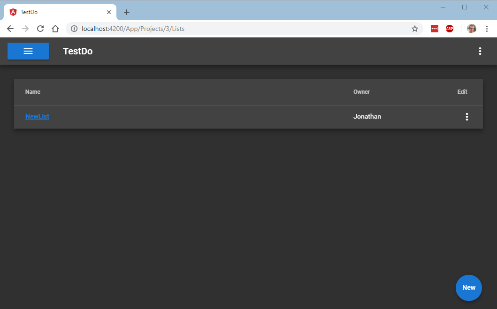
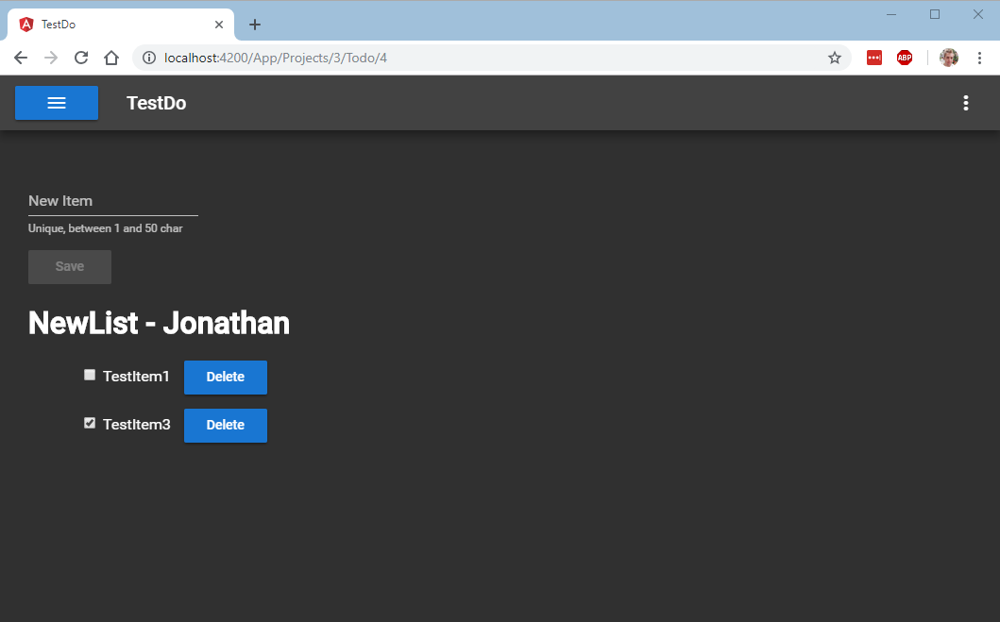

# TestDo

This project is a simple ToDo list application used to demonstrate key concepts and examples of how to unit test an Angular application. The application allows users to create projects consisting of multiple ToDo lists. The application is used to demonstrate some software engineering ang Angular concepts I talk about on my blog over at: [https://jonathansiddle.com/](https://jonathansiddle.com/).

This project was generated with [Angular CLI](https://github.com/angular/angular-cli). To get more help on the Angular CLI use `ng help` or go check out the [Angular CLI README](https://github.com/angular/angular-cli/blob/master/README.md).

## Running with the development server

To set up the local environment run `npm install` this should install the required dependencies.

Run `ng serve` for a dev server. Navigate to `http://localhost:4200/`. The app will automatically reload if you change any of the source files. The application is backed by a json-server json data file. To run json-server run `json-server myData.json --routes routes.json`. More information on json-server can be found [here](https://github.com/typicode/json-server).

## Unit tests

The application comes with a number of unit tests, to check that everything is working correctly run `ng test`.

## Screenshots 

### Projects

### Project Lists

### ToDo List

## License

This project is licensed under MIT: 

MIT License

Copyright (c) 2018 Jonathan Siddle

Permission is hereby granted, free of charge, to any person obtaining a copy
of this software and associated documentation files (the "Software"), to deal
in the Software without restriction, including without limitation the rights
to use, copy, modify, merge, publish, distribute, sublicense, and/or sell
copies of the Software, and to permit persons to whom the Software is
furnished to do so, subject to the following conditions:

The above copyright notice and this permission notice shall be included in all
copies or substantial portions of the Software.

THE SOFTWARE IS PROVIDED "AS IS", WITHOUT WARRANTY OF ANY KIND, EXPRESS OR
IMPLIED, INCLUDING BUT NOT LIMITED TO THE WARRANTIES OF MERCHANTABILITY,
FITNESS FOR A PARTICULAR PURPOSE AND NONINFRINGEMENT. IN NO EVENT SHALL THE
AUTHORS OR COPYRIGHT HOLDERS BE LIABLE FOR ANY CLAIM, DAMAGES OR OTHER
LIABILITY, WHETHER IN AN ACTION OF CONTRACT, TORT OR OTHERWISE, ARISING FROM,
OUT OF OR IN CONNECTION WITH THE SOFTWARE OR THE USE OR OTHER DEALINGS IN THE
SOFTWARE.